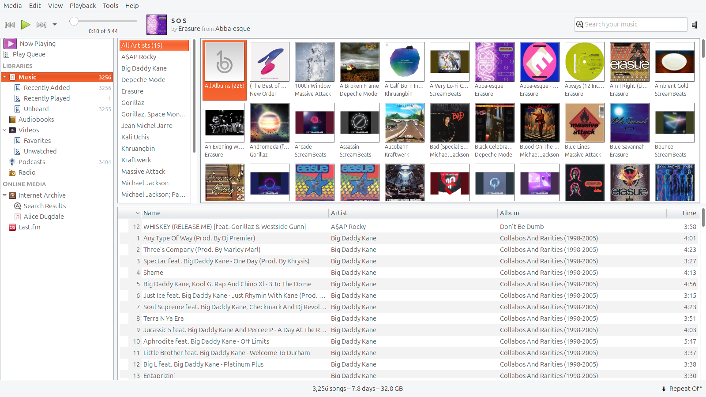
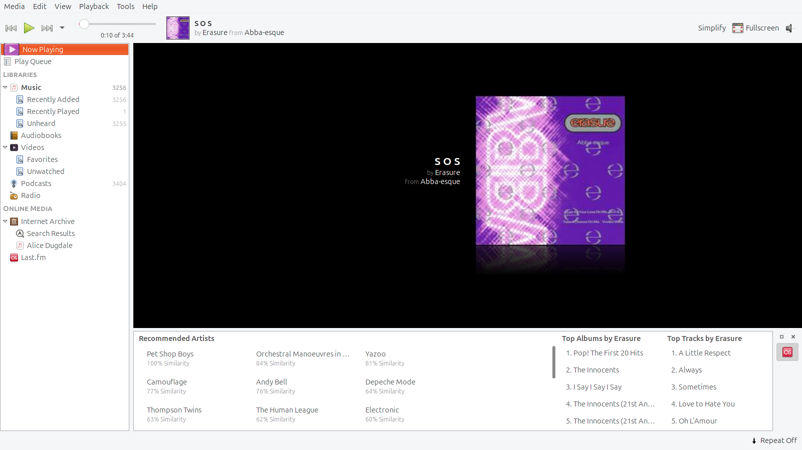
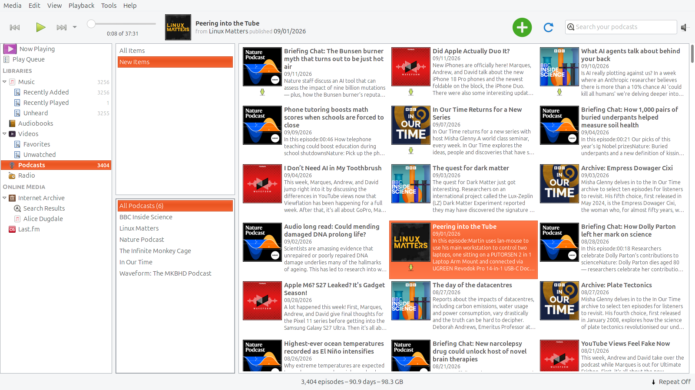
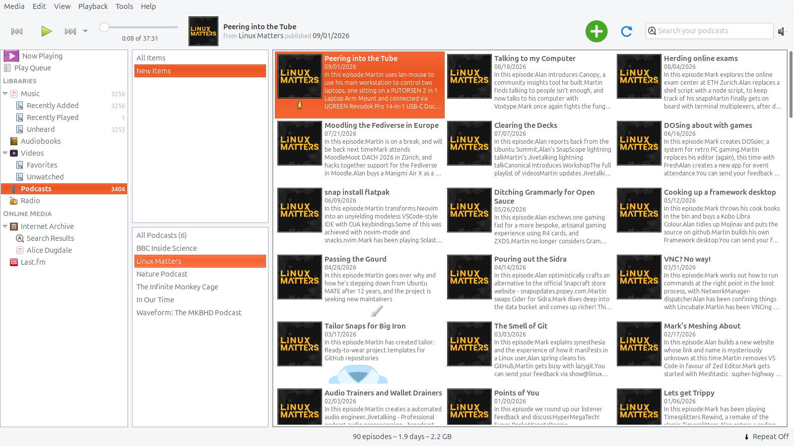
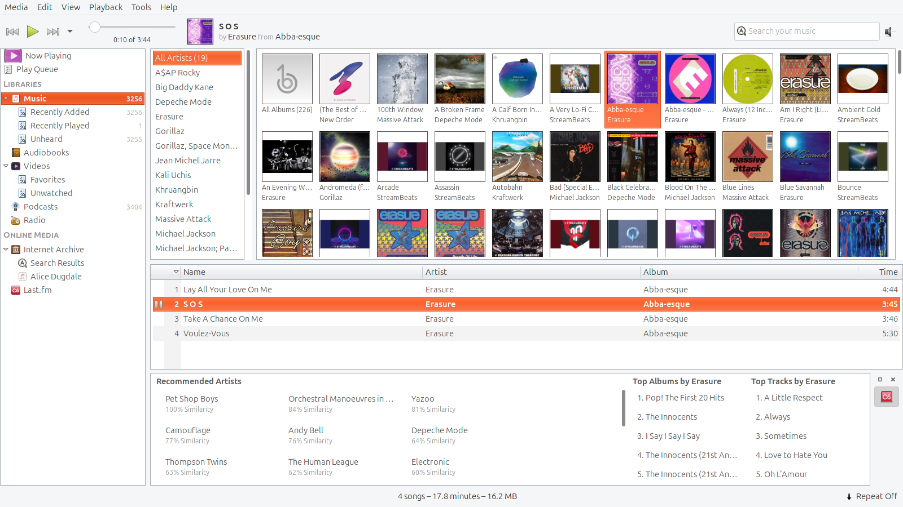
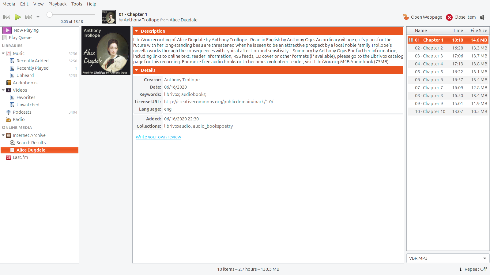

# Banshee 2.6.2 screenshot candidates

Captured from the installed snap on 2026-09-12 with Yaru. Six unedited 1600×900 PNGs, captured from the application window without desktop or browser content. These are Store listing candidates. The snap is now published on stable; these assets have not been uploaded by this task.

## Browse your music collection

Album artwork, artist browsing and a library of 3,256 tracks.

## Now playing

Local music playback with album art and Last.fm recommendations.

## Follow your favourite podcasts

Six subscriptions spanning technology, science and BBC programmes.

## Listen to Linux Matters

Episode browsing, downloaded audio and automatically fetched artwork.

## Discover related music

Last.fm recommended artists, top albums and top tracks alongside your library.

## Explore the Internet Archive

Search, audiobook details and chapter streaming with artwork.

## Capture notes

Music remains in the original Music directory. Of 226 album groups, 208 had artwork automatically; 17 exceptional Erasure box-set/concert entries received manually matched cache images during curation. One untitled group remains without a cover. All six podcast covers were fetched automatically by Banshee. The displayed podcast size totals describe available episodes; only six samples were downloaded (about 253 MiB).

The screenshot collection depicts actual application behaviour. Album and podcast artwork belong to their respective owners; inclusion does not imply their endorsement. See [validation results](../clean-install-validation.md) and [publication plan](../../TODO.md).

## Store icon and copy

[Transparent 512×512 icon](icon.png), [original SVG](icon.svg), and
[prepared listing copy](listing.md) are ready for the Store dashboard.
